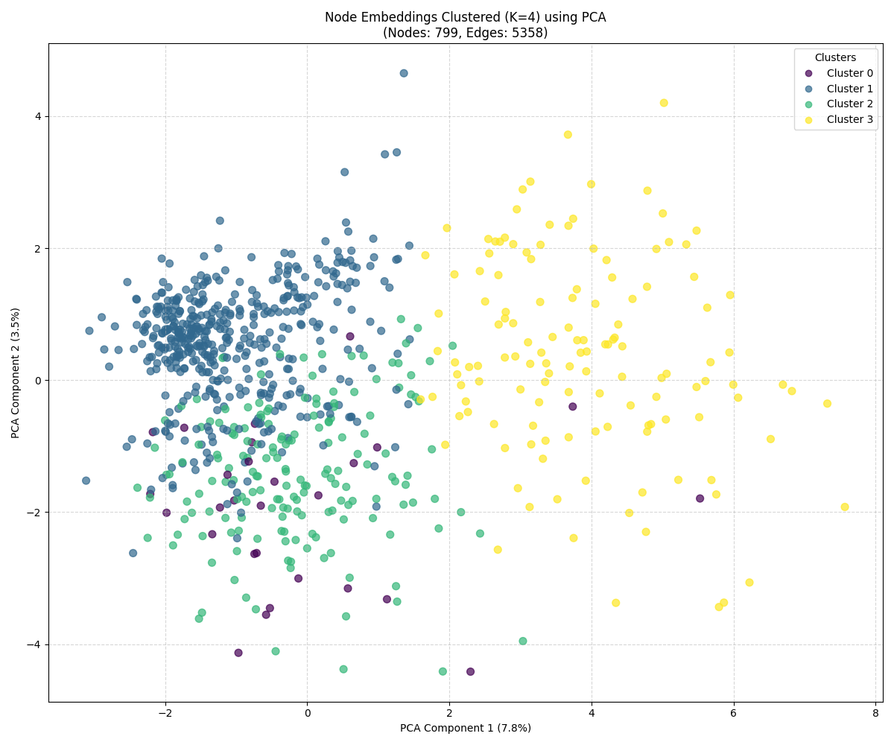

# Finding Clusters using Node2Vec Embedding

Project for identifying clusters of entities (senders/receivers) in transaction networks using Node2Vec biased random walks and a Skip-gram style embedding trained with negative sampling. This repository contains an end-to-end pipeline that builds a directed transaction graph from a payments spreadsheet, generates node walks, trains node embeddings with a small PyTorch skip-gram model, and performs K-Means clustering with an Elbow-method helper and PCA visualization.

## Repository Structure

```
Code.py                     # Main runnable script (annotated and modular)
Payments.xlsx               # Example dataset
Report.pdf                  # Final report and results summary
clustering_plots/           # Output images (e.g. clustered_embeddings_pca.png)
README.md                   
```

## Team

- CS24MTECH14013 : Mohit Manoj Patil
- CS24MTECH14010 : Veeresh Shukla
- CS24MTECH12018 : Deeba Afridi

## Requirements

The code uses the following major Python libraries:

- Python 3.8+
- pandas
- numpy
- networkx
- scikit-learn
- matplotlib
- torch (PyTorch)
- tqdm (optional for progress)

You can install the typical dependencies with pip (preferably inside a virtual environment):

```bash
python3 -m venv .venv
source .venv/bin/activate
python -m pip install --upgrade pip
python -m pip install pandas numpy networkx scikit-learn matplotlib torch tqdm openpyxl
```

Note: `openpyxl` is required to read `.xlsx` files with pandas.

If you need a minimal requirements file for a quick setup, the core packages are:

```
pandas
numpy
networkx
scikit-learn
matplotlib
torch
openpyxl
tqdm
```

## How to run

1. Place your transactions file named `payments.xlsx` in the repository root. Expected columns: `Sender`, `Receiver`, `Amount`.
   - If `payments.xlsx` is not present, the script will generate synthetic transaction data for demonstration.

2. Run the main script:

```bash
python Code.py
```

3. What the script does (high level):

- Loads and validates the transaction data.
- Builds a directed, weighted NetworkX graph after aggregating multiple transactions between the same node pair.
- Uses a Node2Vec-like biased random walk strategy (precomputes alias tables) to generate node sequences.
- Trains a compact Skip-gram style embedding model in PyTorch using negative sampling.
- Uses the Elbow method (WCSS from multiple K tests) to estimate the number of clusters.
- Runs final K-Means clustering and saves a PCA scatter plot of embeddings colored by cluster to `clustering_plots/clustered_embeddings_pca.png`.



## Output / Artifacts
- `clustering_plots/clustered_embeddings_pca.png` — PCA projection of node embeddings colored by cluster.
- In-console logs showing steps, timing, WCSS values and the estimated optimal K.
- Optionally: trained embeddings can be extracted from the `EmbeddingTrainer.get_node_vectors()` method for further analysis.
